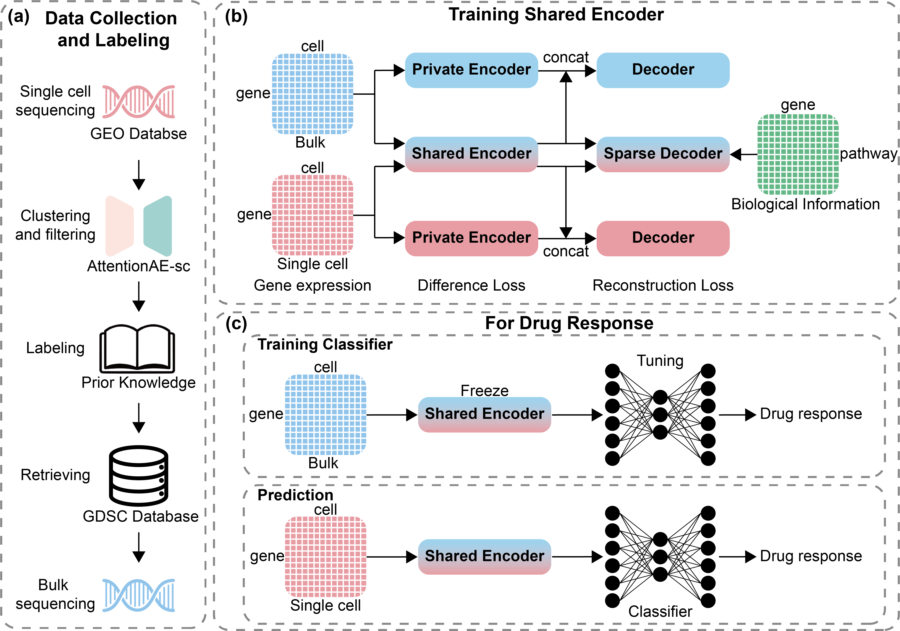

<p align="center"><strong><span style="font-size:45px">Overview</span></strong></p>



<p align="center"><strong><span style="font-size:45px">Codes</span></strong></p>

# Requirements
```
python==3.8.10
torch==1.9.0
scanpy==1.7.1
numpy==1.19.5
pandas==1.1.5
```
Notice: Requirements are not strictly limited to the above versions. But please be careful to the version of `scanpy`, make sure it can load the data.

# Usage
Just simply run the `train.py`
Notice:
- `train.py` is the main file to run the training process.
- Before running, make sure to download required datasets and place them in the `./Data`.
  - `./Data/pathways/XX.gmt` for pathways
  - `./Data/filter_ccle.h5ad` for bulk RNA-seq data
  - `./Data/filter_pan_cancer.h5ad` for pretraining
- Before running, make sure to specify paths to all files, including bulk, single-cell and pathways.
- Feel free to change any hyperparameters in the `train.py` file.